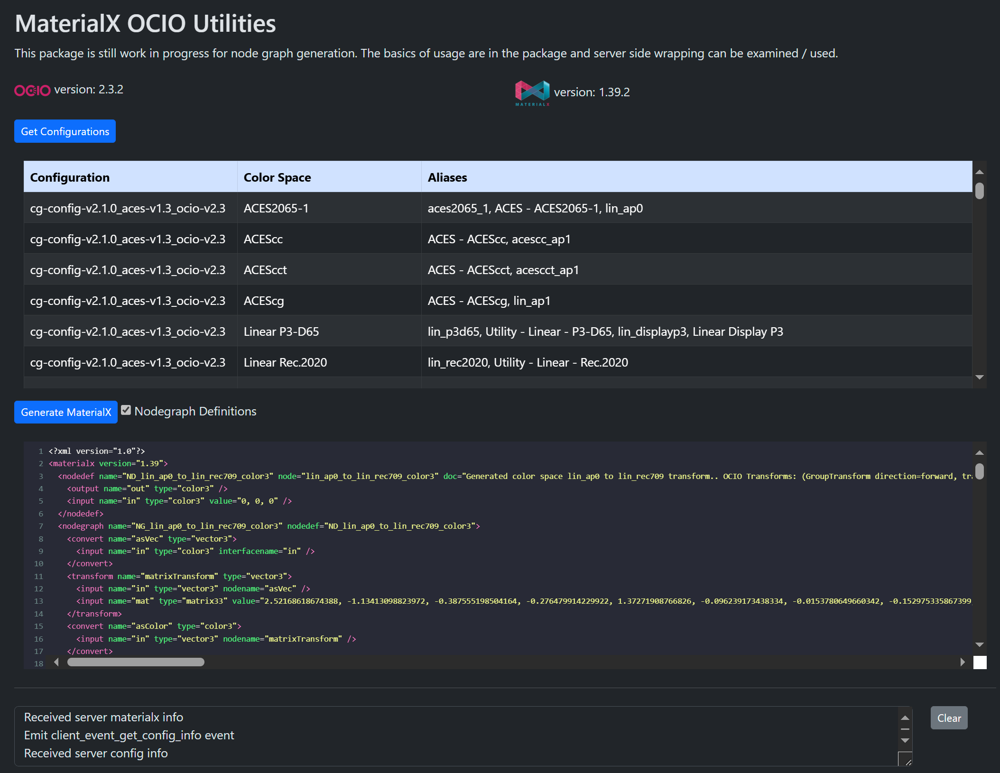

## MaterialX OCIO Application



MaterialX OCIO Flask App. Reads in default AcesCG config from OCIO and allows
for generation of supported MaterialX definitions either in source code or
graph form.

Note: This is just a sample application with graph generation still in progress.

### Dependents
- `flask` and `flask-socketio` Python packages
- `socket-io` Javascript library
- `materialxocio` MaterialX / OCIO library which contains logic for generation. See <a
href="https://github.com/kwokcb/materialxocio" target="_blank">Github repository</a> for more details. This library will pull in:
    - `Materialx` : whatever version if installed. The minimum version is 1.38.9.
    - `opencolorio` : Version 2.2.0 is minimally required as this version includes default configurations  
    as part of the package.

### Installation

Either install the package from `PyPi` (soon to be available):

```
pip install materialx_ocio_app
```

or clone the <a href="https://github.com/kwokcb/materialxWeb">materialXWeb</a>  
repository and install from the `flast/ocio` folder under the root:

```
pip install .
```

or 

```
pip install -e .
```
if planning to perform edits on the repository.

### Execution

Run the main package using:
```
materialx_ocio_app
```
or directly with Python:
```
python materialx_ocio_app.py
```

By default the application is running a local server. To access the client page open the following in a Web browser:
```
http://127.0.0.1:<port-number>
```
where `<port-number>` is the chosen port to host from.


